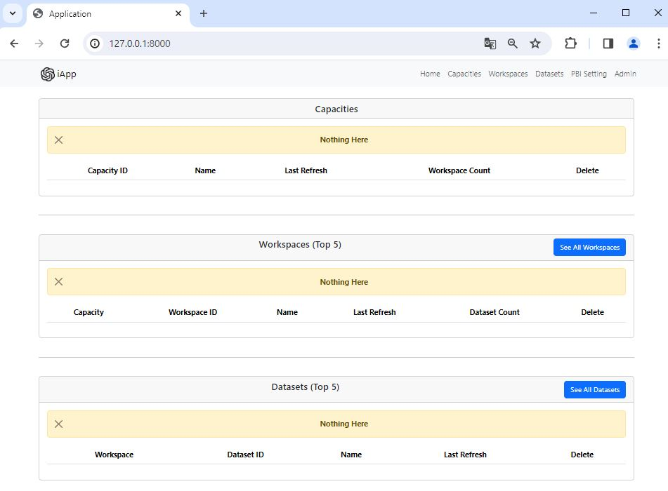
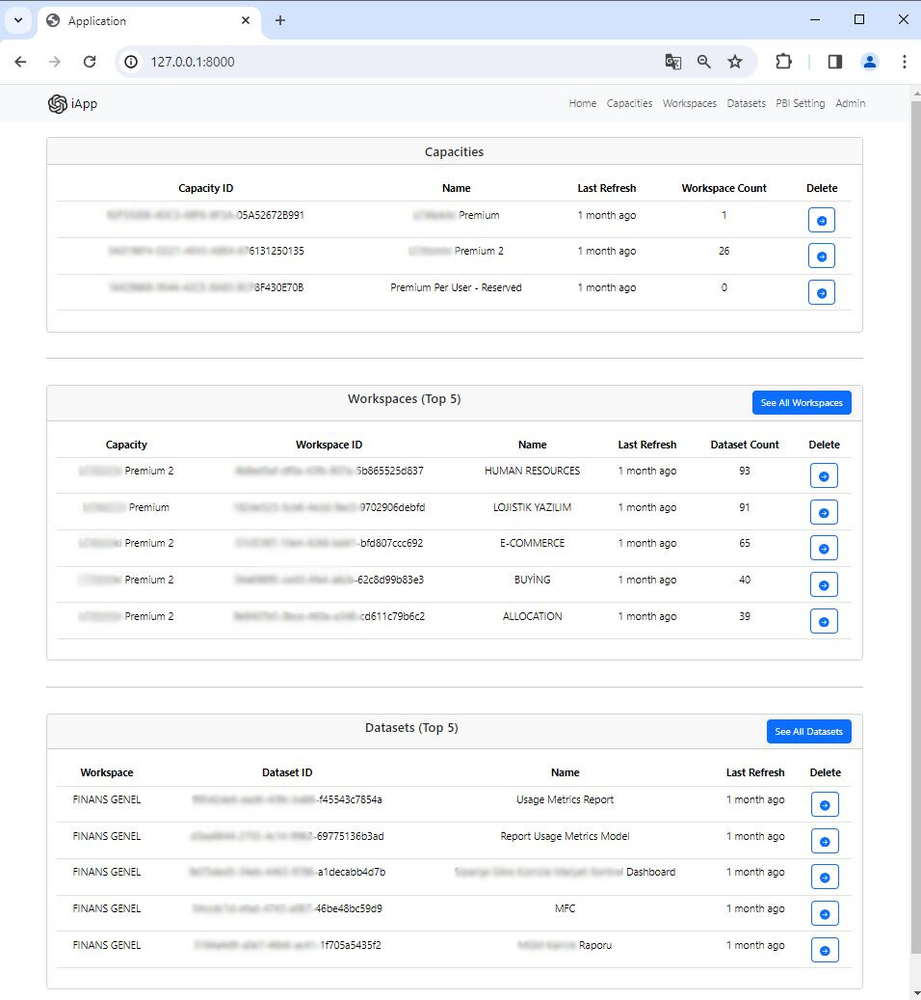
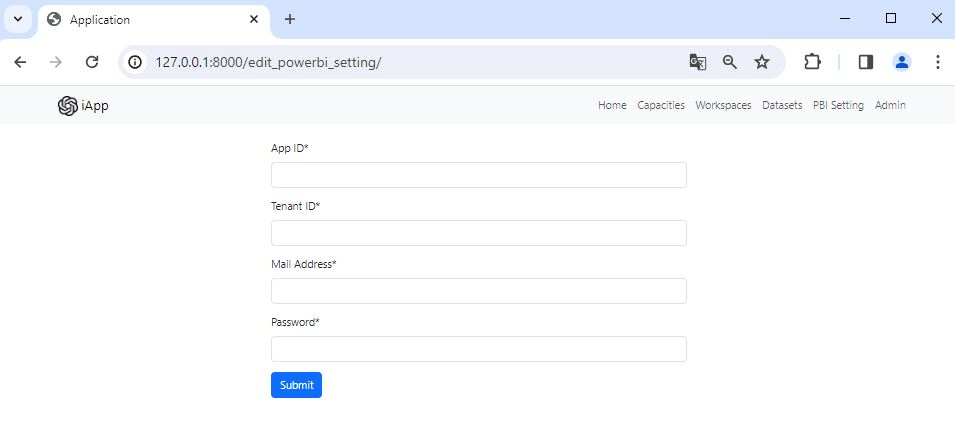
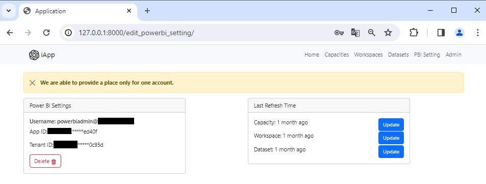
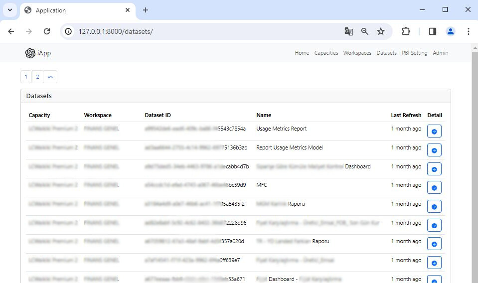
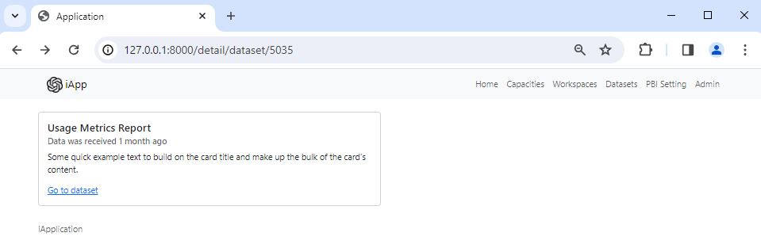

# Django Power BI Web App.

This app uses Power BI REST API. For now, there is very limited features; however, I am going to develop new ones by the time. I am aiming to enhance my Back-End skills, therefore I do not spend time for Front-End in this project.
You must have an account that has permissions to read data by REST API.

What you can do:
• You can see your capacities, workspaces (top 5) and datasets (top 5) in one page. Also, how many workspaces is involved in every each capacity and how many datasets is involved in every each workspace.
• There are pages in order to show all workspaces and datasets.

To use:

• Create a .env file and provide a secret key inside it.
• Make migrations and migrate.
• Go to admin panel. Username and password are "admin".
• Go to PowerBI_Settings model and add one.
• Click view site and click update. For now, you have to update in order (Capacity -> Workspace -> Dataset) because they are used hierarchy.

New features will be added.

## Images

You have to log in with admin account to see PBI Setting page. You may save your necessary settings to use Power BI Rest API.

If you have already saved necessary settings, you can update data here. (You can not refresh a dataset from here. You can only get fresh data for your capacities, workspaces and datasets from Power BI.)

List pages exist for capacities, workspaces and datasets. 

Detail pages exist for capacities, workspaces and datasets. You can see name of the relevant asset, when is the last update date and find direct link to open it on Power BI Web.
